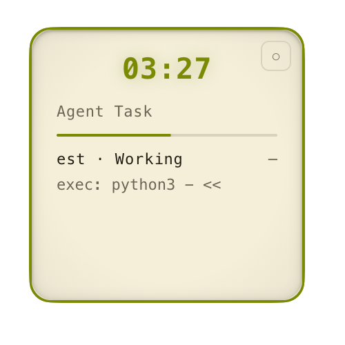
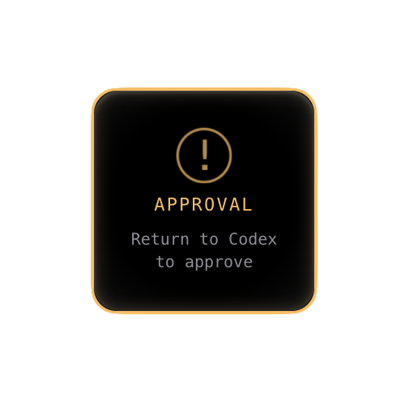
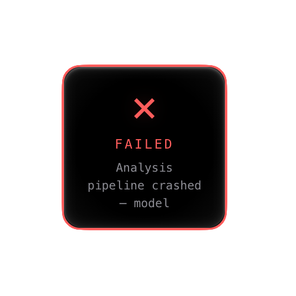
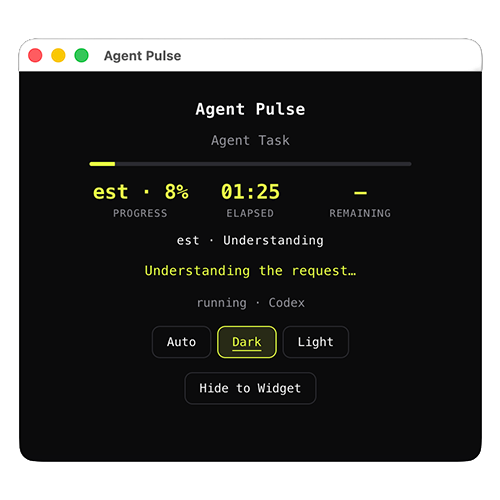

# Agent Pulse

**macOS 菜单栏 AI 任务进度组件** —— 一个悬浮在桌面角落的 OS 级小组件，实时显示 Codex 与 Claude Code 长任务的耗时、进度与当前动作，并在任务完成、等待批准、失败时提醒你。

> An OS-level floating progress widget for long-running AI agent tasks on macOS.

[](LICENSE)

## 它能做什么

把跑在终端里的 AI Agent 任务状态，变成一个悬浮在桌面上的小卡片：

- **实时进度**：增量读取本机 `~/.codex/sessions` 与 `~/.claude/projects` 的 JSONL 日志，识别任务的生命周期事件（开始、当前动作、完成、失败、取消、待批准）。
- **一眼看懂**：紧缩卡片显示耗时；悬停展开显示任务摘要、预估进度、当前活动与剩余时间。
- **到点提醒**：任务完成、需要批准、失败时，播放独立音效并弹出系统通知（均可关闭）。
- **一键回到现场**：点击完成 / 待批准 / 失败卡片，直接唤起对应应用——Codex 桌面版，或正在运行 Claude Code 的终端（iTerm2、Terminal、Warp、WezTerm、ghostty、VS Code、Cursor）。
- **双语与外观**：中 / 英文切换；深色 / 浅色 / 自动三种外观（“自动”与系统明暗反向，保证卡片在桌面上始终醒目）。
- **后台常驻**：通过 macOS LaunchAgent 注册登录自启，无 Dock 图标，像系统组件一样安静运行。

## 界面一览

| 状态 | 尺寸（宽 × 高） | 说明 | 预览 |
|---|---|---|---|
| 紧缩 | 86 × 43 | 横向胶囊，只显示耗时与细进度条 |  |
| 展开 | 200 × 200 | 任务标题、进度、阶段、当前动作、剩余时间 |  |
| 完成 | 104 × 104 | ✓ 动画定格，点击回到 Agent |  |
| 待批准 | 140 × 140 | `!` 提示返回 Agent 批准，优先于其它状态 |  |
| 失败 | 140 × 140 | × 独立音效与动画，显示错误摘要 |  |
| 详情 | 460 × 420 | 任务进度 %、耗时、剩余、阶段与当前动作 |  |

- 新任务开始时自动展开 3 秒后收起；悬停展开、移开收起，支持拖动定位。
- 空闲时卡片隐藏，菜单栏可手动显示 / 隐藏。

## 环境要求

- **macOS**（菜单栏、LaunchAgent、`open -b` 等能力仅限 macOS）
- **Node.js 20+**（仅开发 / 从源码安装时需要）
- 本机运行的 **Codex** 或 **Claude Code** 会话

## 安装

```sh
npm install
npm run background:install
```

安装命令会先构建，然后启动组件并注册当前用户的登录自启服务（LaunchAgent）。

- 请保留项目目录与 `node_modules`；升级后重新执行安装命令即可。
- 卸载登录自启：`npm run background:uninstall`。

## 待批准提醒（可选）

Agent 处于“等待批准”时，组件需要额外配置才能在第一时间感知：

```sh
node scripts/install-alert-hooks.cjs
```

- 该命令向 Codex 的 `hooks.json` 和 Claude Code 的 `settings.json` 注入**仅通知**的 hook，绝不代替你批准。
- 已有配置会被自动备份并原样保留；Codex 需通过自身的 hooks 信任流程启用，Claude Code 在下次新会话验证加载。

## 使用

所有控制都集中在菜单栏图标里：

| 菜单项 | 作用 |
|---|---|
| 显示 / 隐藏组件 | 手动开关悬浮卡片 |
| 打开详情窗口 | 查看当前任务的进度 %、耗时、剩余、阶段与动作 |
| 运行演示任务 | 手动触发一个示例任务（用于预览与测试） |
| 暂停 / 继续 / 取消 / 模拟失败 | 仅作用于演示任务 |
| 外观 | 深色 / 浅色 / 自动 |
| 语言 | English / 中文 |
| 声音 / 通知 | 独立开关 |
| 退出 | 结束进程 |

交互细节：

- **点击卡片**：完成 / 待批准 / 失败状态唤起对应应用；其它状态打开详情窗口。
- **展开卡片右上角**：点按可循环切换外观。

## 如何工作

```
┌─────────────┐   JSONL 增量读取   ┌────────────────────┐
│ ~/.codex/    │ ────────────────▶ │  AgentMonitor       │
│ ~/.claude/   │   解析生命周期信号  │  (主进程)           │
└─────────────┘                    │  start / activity / │
                                   │  complete / fail /  │
                                   │  approval ...       │
                                   └─────────┬───────────┘
                                             │ IPC（进度 / 设置）
                                   ┌─────────▼───────────┐
                                   │  React 渲染层        │
                                   │  Widget / 详情窗口   │
                                   └─────────────────────┘
```

- **主进程** `src/main/agentMonitor.ts` 增量轮询日志文件（跳过历史、处理 UTF-8 拆行、发现新文件），识别任务生命周期信号。
- **渲染层** `src/renderer/` 是 React 组件，通过 preload 暴露的 `window.agentPulse` 接口收发进度与设置。
- **共享契约** `src/shared/` 定义类型、双语字符串、尺寸与主题，主进程 / preload / 渲染层共用。

几个关键行为：

- **进度是本地估算**：按“理解 → 收集 → 执行 → 检查”四阶段推进，运行中最高 95%；只有明确的结束事件才标记完成。单个工具失败或可重试错误不算任务失败。
- **完成态保持**：完成后卡片定格，直到明确的新任务开始；普通工具活动不会被误判为“新任务”。
- **任务摘要本地生成**：通过本地规则 + 关键词把提示词压缩成简短标题（如“生成市场报告”），不调用任何 API、不上传任务正文。
- **hooks 队列只存事件**：仅保存事件与关联标识，读取后即删除。

## 开发

```sh
npm install          # 安装依赖
npm run dev          # 开发运行（热更新）
npm test             # 单元测试（解析 / 状态 / 标题 / 应用路由）
npm run build        # 类型检查 + 构建
npm run test:ui      # 静态验证尺寸、详情按钮、音效、展开收起与卡片点击
```

窗口交互验证需要 macOS 图形会话，测试不会真正打开 Agent 应用。

## 项目结构

```
src/
├── main/            # Electron 主进程：日志解析、托盘、窗口、打开 Agent、设置持久化
│   └── agentMonitor.ts   # 核心：日志增量轮询与生命周期信号识别
├── preload/         # contextBridge 暴露 window.agentPulse
├── renderer/        # React：Widget 卡片、详情窗口、样式、hooks、音效
│   └── src/components/   # Widget.tsx / MainView.tsx / HairlineProgress.tsx
└── shared/          # 类型、i18n、尺寸、主题、任务摘要（三进程共享）
scripts/             # 登录自启、hooks 安装、通知、各类验证脚本
tests/               # 单元测试（node --test）
```

更细的维护索引见 [TASK_PLAN.md](TASK_PLAN.md)。

## 隐私与局限

- **全部本地运行**：不联网、不收集，任务正文从不上传。
- 仅支持写入上述日志路径的**本机会话**；远程、静默或无日志的任务无法可靠判断完成。
- 日志格式变化可能需要更新适配器。
- 点击唤起应用时，不保证定位到具体的会话或终端标签页。

## License

[MIT](LICENSE)
